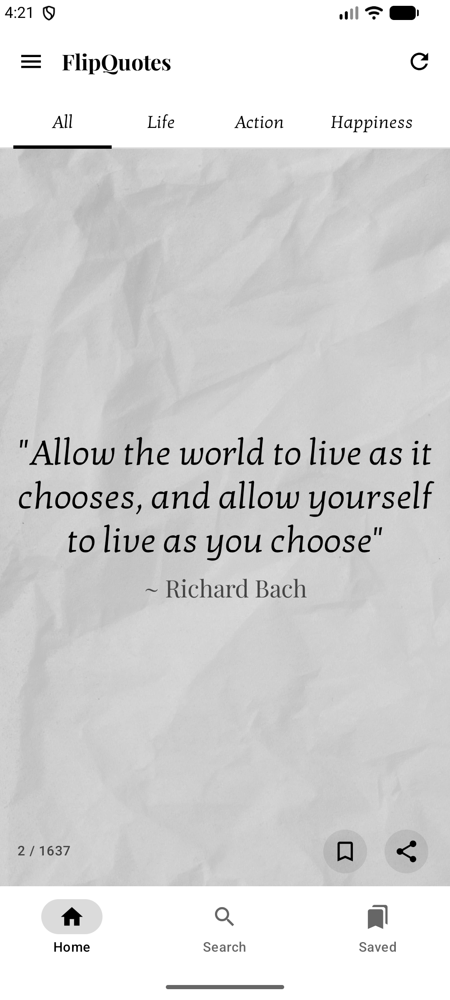
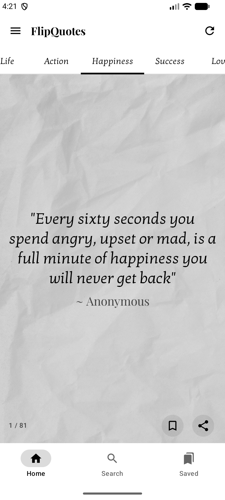
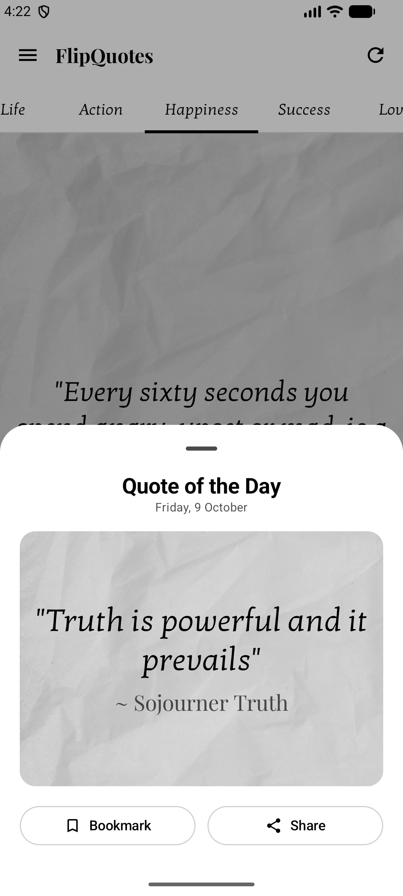
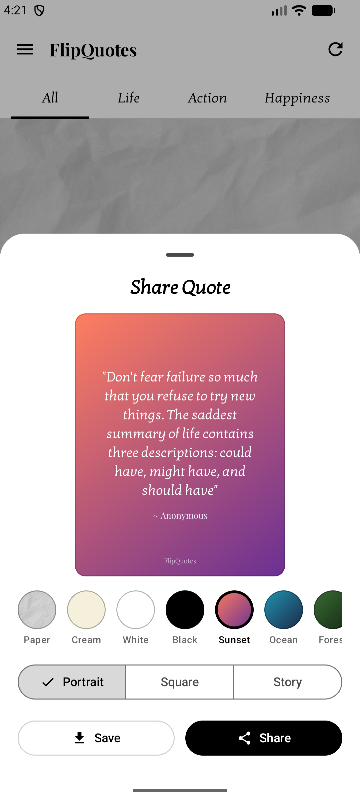
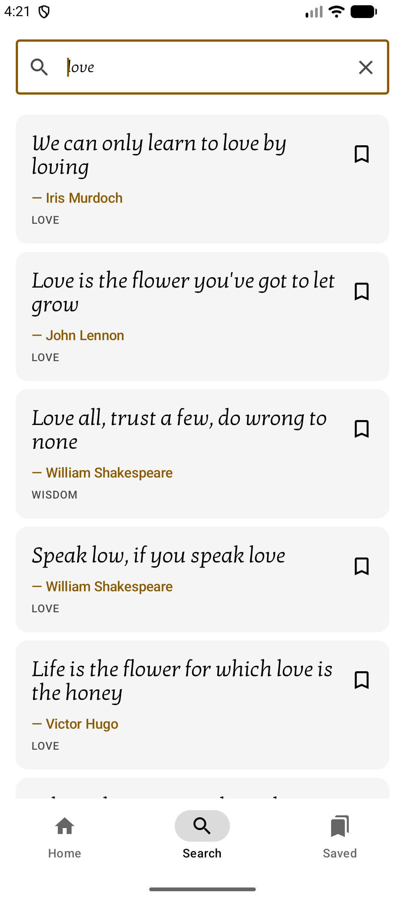
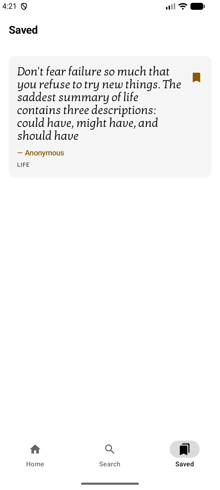
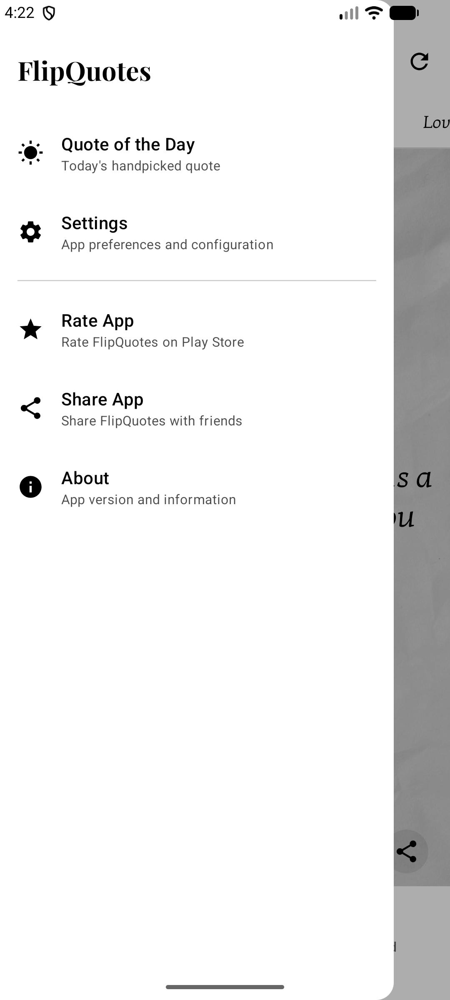
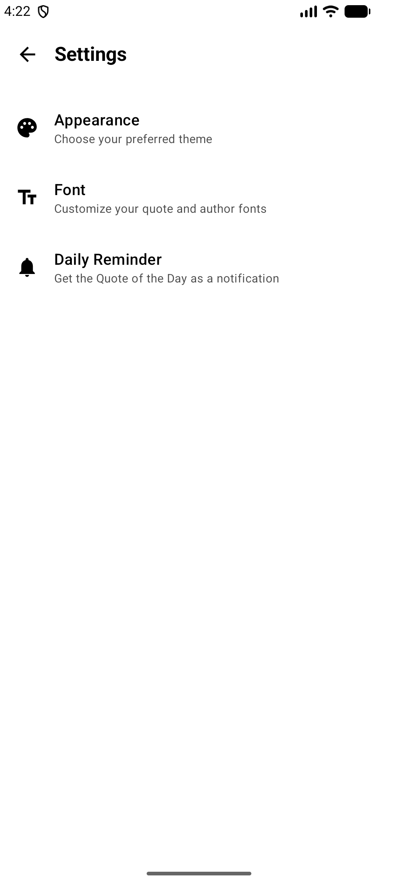
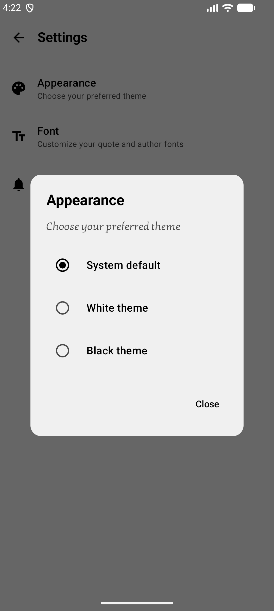

# FlipQuotes App

FlipQuotes is an Android application inspired by the layout of InShorts. The app displays quotes with their authors and provides functionality to refresh the quotes and share them.

## Screenshots

| Home | Theme tabs | Quote of the Day |
|:---:|:---:|:---:|
|  |  |  |

| Share | Search | Saved |
|:---:|:---:|:---:|
|  |  |  |

| Menu | Settings | Appearance |
|:---:|:---:|:---:|
|  |  |  |

## Features

- Display quotes with authors.
- Refresh button to load new quotes.
- Share button to share quotes as images.

## Installation

1. Clone the repository:
    ```sh
    git clone https://github.com/Amrish-Sharma/FlipQuotes.git
    ```
2. Open the project in Android Studio.
3. Build the project to download dependencies and set up the environment.

## Usage

- Launch the app to view quotes.
- Tap the refresh button at the top right to load a new quote.
- Tap the share button to share the current quote as an image.

## Contributing

1. Fork the repository.
2. Create a new branch (`git checkout -b feature-branch`).
3. Commit your changes (`git commit -m 'Add some feature'`).
4. Push to the branch (`git push origin feature-branch`).
5. Open a pull request.

## License

This project is licensed under the MIT License.
